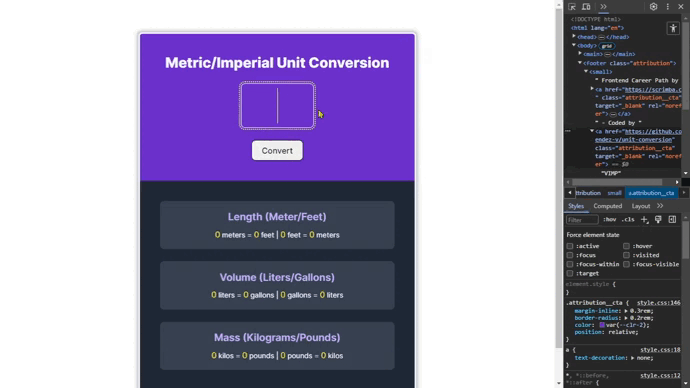

# Unit Conversion

This is my solution to the **Solo Projet**: **Unit Conversion** of the course [Frontend Career Path]() by [Scrimba]().



### Table Contents

+ [The goals](#the-goals)
+ [Screenshots](#screenshots)
+ [Links](#links)
+ [Built with](#built-with)
+ [What I learnt](#what-i-learnt)
+ [Useful resources](#useful-resources)
+ [Author](#author)


## *The goals*

🎯 Follow the design spec

🎯 Generate all conversions when the user click "Convert"

🎯 Round de the numbers down to three decimal places

## *Screenshots*

### 📱 Mobile


### 💻 Desktop


## *Links*

[Live Site](https://mendez-v.github.io/unit-conversion/) 👀

[Scrim URL](https://scrimba.com/scrim/cVLv7kAM) 👀

[Frontend Career Path projects](https://github.com/mendez-v/frontend-career-path) 👀

## *Built with*

✅ Mobile-first workflow

✅ Semantic HTML markup

✅ Custom properties

✅ CSS Grid

## *What I learnt*

🔥 `.slice()` - method returns a copy of a part of the array into a new array starting from start to end (end not included). The original array will not be modified.

```js
numberInpt.value = numberInpt.value.slice(0, 3);
```

🔥 `.toFixed()` - - method formats a number using fixed point notation.

```js
meterToFeet: (unit.meter * input).toFixed(3)
```


## *Useful resources*

📌 [.toFixed()](https://developer.mozilla.org/en-US/docs/Web/JavaScript/Reference/Global_Objects/Number/toFixed) by MDN

🌈 Favicon - <a href="https://www.flaticon.com/free-icons/gear" title="gear icons">Gear icons created by Freepik - Flaticon</a>
## *Author*

✨ Frontend Mentor - [@mendez-v](https://www.frontendmentor.io/profile/mendez-v)
